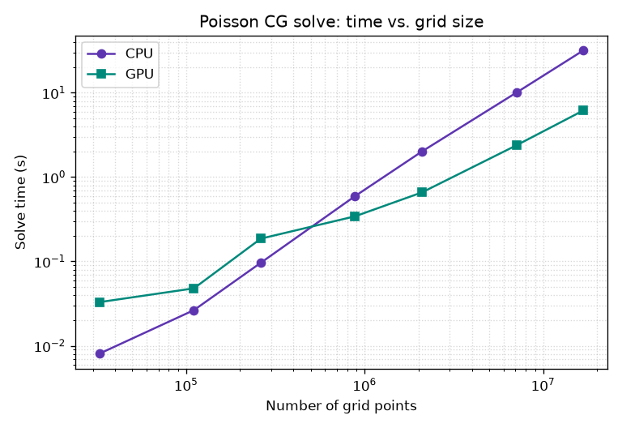

# Benchmark

Wall time of the unpreconditioned conjugate-gradient solve in the
[Poisson example](examples.md) (`examples/poisson.py`), across log-spaced 3D
grid sizes, on the CPU and the GPU. Lower is better.

!!! info "Test machine"
    - **CPU:** Intel(R) Core(TM) Ultra 7 356H (16 logical cores)
    - **GPU:** NVIDIA RTX PRO 500 Blackwell Generation Laptop GPU

Run configuration: 3D grid, hard-coded Laplace operator, no preconditioner,
relative tolerance `1e-6`. Times are the solver wall time (`total_time_seconds`,
excluding setup) for a single run per size.

| Implementation | 32³ (33k) | 48³ (111k) | 64³ (262k) | 96³ (885k) | 128³ (2.1M) | 192³ (7.1M) | 256³ (16.8M) |
|---|---|---|---|---|---|---|---|
| CPU | 0.00808 | 0.0264 | 0.0964 | 0.596 | 2.02 | 10 | 31.7 |
| GPU | 0.0329 | 0.0479 | 0.186 | 0.343 | 0.659 | 2.38 | 6.15 |

(values are **solve time in seconds**)



The problem is memory-bandwidth-bound (arithmetic intensity ≈ 0.16 FLOP/byte),
so the time tracks memory throughput rather than peak FLOPs, and the
unpreconditioned CG iteration count grows with grid size — hence the
slightly-steeper-than-linear slope on the log-log plot.

This page is generated by `examples/benchmark.py`. Regenerate it on your own
machine with:

```bash
python examples/benchmark.py --doc-out docs/benchmark.md \
    --plot-out docs/benchmark.png
```
