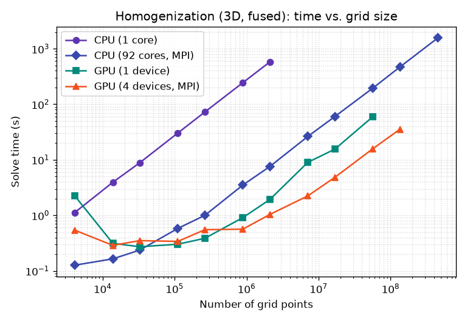

# Benchmark: homogenization

Wall time of the FEM elasticity [homogenization example](examples.md)
(`examples/homogenization.py`, fused stiffness kernel), across log-spaced **3D**
grid sizes. Lower is better.

!!! info "Test machine & code version"
    - **CPU:** AMD Instinct MI300A Accelerator (192 logical cores)
    - **GPU:** 4x AMD Instinct MI300A
    - **muGrid:** `0.109.0-55-g0d9153f6-dirty` — run 2026-06-28T00:15:03

Run configuration: 3D single spherical inclusion, fused stiffness kernel,
6 load cases, fixed `100` CG iterations per load case — i.e. a **fixed work
budget** so every configuration performs identical arithmetic. Times are the
solver wall time (`total_time_seconds`, excluding setup).

## Time vs. grid size

The plot below merges several ways of running the *same* solve on this machine:

- **CPU (1 core)** — a single core, MPI disabled. muGrid's compute kernels carry
  no OpenMP, so a non-MPI CPU run uses exactly one core. Only swept up to
  128³; a single core is hopeless beyond that.
- **CPU (92 cores, MPI)** — the whole CPU via MPI domain decomposition
  (`mpiexec -n 92`), the grid split into per-rank subdomains that exchange
  ghost layers each iteration.
- **GPU (1 device)** — a single GPU.
- **GPU (N devices, MPI)** — several GPUs via MPI domain decomposition, one rank per device (round-robin).

Each configuration is swept to the largest grid that still fits in memory: the
first size that runs **out of memory** is recorded as `OOM` in the table and
dropped from the plot, and larger sizes for that configuration are not attempted.

| Configuration | 16³ (4k) | 24³ (14k) | 32³ (33k) | 48³ (111k) | 64³ (262k) | 96³ (885k) | 128³ (2.1M) | 192³ (7.1M) | 256³ (16.8M) | 384³ (56.6M) | 512³ (134.2M) | 768³ (453.0M) |
|---|---|---|---|---|---|---|---|---|---|---|---|---|
| CPU (1 core) | 1.13 | 3.94 | 8.86 | 30.4 | 72.4 | 245 | 578 | — | — | — | — | — |
| CPU (92 cores, MPI) | 0.127 | 0.164 | 0.237 | 0.582 | 0.998 | 3.51 | 7.57 | 26.3 | 60.1 | 196 | 468 | 1.57e+03 |
| GPU (1 device) | 2.24 | 0.313 | 0.272 | 0.302 | 0.385 | 0.909 | 1.92 | 9.02 | 15.5 | 59.9 | OOM | — |
| GPU (4 devices, MPI) | 0.54 | 0.288 | 0.35 | 0.339 | 0.551 | 0.563 | 1.04 | 2.24 | 4.83 | 15.8 | 35.4 | OOM |

(values are **solve time in seconds**; `OOM` = the run ran out of memory)



A single CPU core is quickly left behind, so the fair comparison is the full CPU
(all 92 cores via MPI) against the GPU(s). The GPU leads in the mid-range,
where the heavy per-point FEM stiffness kernel keeps it busy and the working set
fits in device memory. The largest grids are reached only by MPI domain
decomposition — across all CPU cores, or across several GPUs (one rank per
device, round-robin) — which is also what pushes each curve's memory ceiling out
before the `OOM` cutoff.

All data points live in the shared benchmark database `benchmarks/results.csv`
(date, code version, machine, parameters, results). This page is generated by
`examples/benchmark_homogenization.py`; re-render it from the database (no
recompute) with `--render-only`, or run a fresh measurement that appends a new
dated row set:

```bash
python examples/benchmark_homogenization.py \
    --doc-out docs/benchmark_homogenization.md \
    --plot-out docs/benchmark_homogenization.png
```
