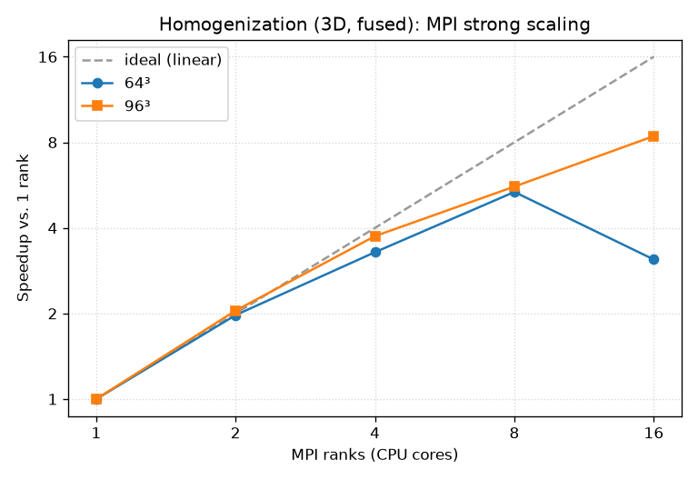

# Benchmark: homogenization

Wall time of the FEM elasticity [homogenization example](examples.md)
(`examples/homogenization.py`, fused stiffness kernel), across log-spaced **3D**
grid sizes, on the CPU and the GPU. Lower is better.

!!! info "Test machine"
    - **CPU:** Intel(R) Core(TM) Ultra 7 356H (16 logical cores)
    - **GPU:** NVIDIA RTX PRO 500 Blackwell Generation Laptop GPU (6113 MiB)

!!! warning "The CPU baseline is single-threaded"
    muGrid's compute kernels carry no OpenMP, and this build has MPI disabled, so
    the example runs on **one CPU core**. The comparison below is therefore *one
    CPU core* vs. the whole GPU. MPI domain decomposition is available for
    multi-core/multi-node CPU runs (`mpiexec -n N`, an MPI-enabled build), but is
    not exercised here.

Run configuration: 3D single spherical inclusion, fused stiffness kernel,
6 load cases, fixed `100` CG iterations per load case — i.e. a **fixed work
budget** so both devices perform identical arithmetic. Times are the solver wall
time (`total_time_seconds`, excluding setup).

| Implementation | 16³ (4k) | 24³ (14k) | 32³ (33k) | 48³ (111k) | 64³ (262k) | 96³ (885k) | 128³ (2.1M) |
|---|---|---|---|---|---|---|---|
| CPU (1 core) | 0.585 | 1.66 | 4.04 | 14.9 | 35.3 | 121 | 287 |
| GPU | 0.732 | 0.962 | 1.38 | 2.67 | 5.5 | 17.2 | 156 |
| **Speedup (CPU/GPU)** | 0.80× | 1.73× | 2.94× | 5.57× | 6.42× | 7.03× | 1.84× |

(values are **solve time in seconds**)


The 3D operator runs 6 load cases with a heavy per-point FEM stiffness kernel, so
the GPU amortizes its kernel-launch overhead early — it overtakes a single CPU
core at roughly 24³ and reaches ~7× by 96³.

!!! warning "GPU memory wall at 128³"
    A 128³ run needs about 5.85 GB of field storage, which nearly fills this
    GPU's 6 GB. The working set no longer fits comfortably, the allocator
    oversubscribes to host memory, and the GPU's effective throughput collapses
    (here to ~6 GB/s), so the speedup falls from ~7× at 96³ to under 2×. On a
    6 GB card, ~96³ is the largest 3D problem that
    stays on the fast path; larger grids need a bigger-memory GPU or MPI domain
    decomposition across several GPUs.

This page is generated by `examples/benchmark_homogenization.py`. Regenerate it
on your own machine with:

```bash
python examples/benchmark_homogenization.py \
    --doc-out docs/benchmark_homogenization.md \
    --plot-out docs/benchmark_homogenization.png
```

## MPI strong scaling (CPU)

The table above uses a single CPU core. muGrid parallelises across cores (and
nodes) with MPI domain decomposition — the grid is split into per-rank
subdomains that exchange ghost layers each iteration. Below is the **strong
scaling** of the same 3D fused solve (fixed problem size, increasing MPI ranks)
on the 16-core CPU, with `E_eff` identical across all rank counts.

**64³ (262,144 points)**

| Ranks | Time (s) | Speedup | Parallel eff. | Agg. GB/s |
|---|---|---|---|---|
| 1 | 36.79 | 1.00× | 100% | 3.2 |
| 2 | 18.64 | 1.97× | 99% | 6.3 |
| 4 | 11.20 | 3.29× | 82% | 10.6 |
| 8 | 6.87 | 5.35× | 67% | 17.2 |
| 16 | 11.88 | 3.10× | 19% | 10.0 |

**96³ (884,736 points)**

| Ranks | Time (s) | Speedup | Parallel eff. | Agg. GB/s |
|---|---|---|---|---|
| 1 | 119.95 | 1.00× | 100% | 3.3 |
| 2 | 58.60 | 2.05× | 102% | 6.8 |
| 4 | 32.05 | 3.74× | 94% | 12.4 |
| 8 | 21.46 | 5.59× | 70% | 18.6 |
| 16 | 14.26 | 8.41× | 53% | 28.0 |



Scaling is near-ideal to 4 ranks, then tapers: the solve is memory-bandwidth
-bound, and aggregate throughput climbs from ~3 GB/s (1 core) toward ~28 GB/s as
cores are added but parallel efficiency falls. At 64³, 16 ranks *regresses*
(19% efficiency) — only ~16k points per rank, so ghost exchange and CG dot-product
reductions dominate; the sweet spot there is 8 ranks. The larger 96³ problem keeps
scaling, reaching 8.4× on 16 cores.

!!! note "The “7×” headline is versus one core — against the whole CPU it is a tie"
    Comparing the **full 16-core CPU** with the GPU on the same problem:

    | Grid | Best CPU (MPI) | GPU | Faster |
    |---|---|---|---|
    | 64³ | 6.87 s (8 ranks) | 5.50 s | GPU, ~1.25× |
    | 96³ | 14.26 s (16 ranks) | 17.19 s | **CPU, ~1.2×** |

    So the single-core "~7× GPU" result reflects the CPU baseline using one of
    16 cores. With MPI across all cores, this 16-core laptop CPU and the entry
    6 GB laptop GPU are roughly tied — and the CPU actually wins at 96³. A
    larger/datacentre GPU (more bandwidth and memory) would change this balance;
    the point is to compare like with like.

The MPI numbers are produced by `examples/benchmark_homogenization_mpi.py`, which
needs an MPI-enabled build and `mpi4py`:

```bash
cmake -S . -B build-mpi -DCMAKE_BUILD_TYPE=Release -DMUGRID_ENABLE_MPI=ON
cmake --build build-mpi --target _muGrid
export PYTHONPATH=$PWD/build-mpi/language_bindings/python:$PWD/language_bindings/python
python examples/benchmark_homogenization_mpi.py \
    --plot-out docs/benchmark_homogenization_mpi.png
```
