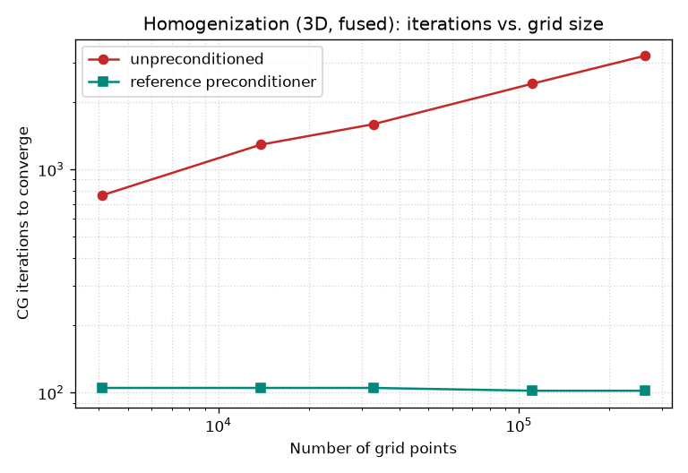
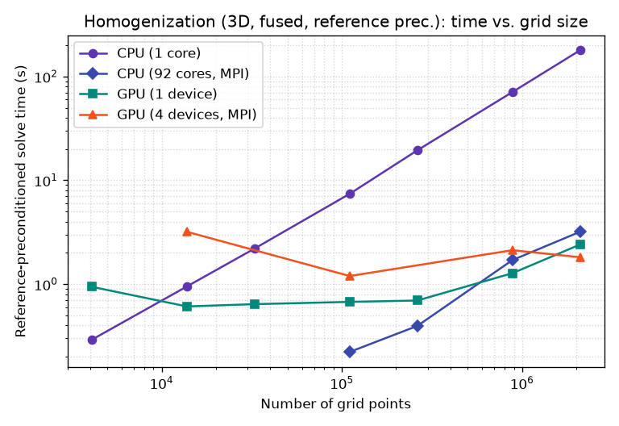
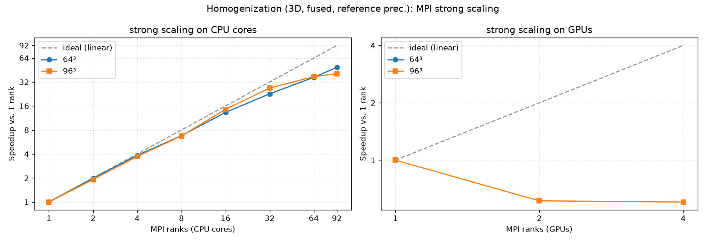

# Benchmark: preconditioner

Effect of the reference-material (Green's-function) preconditioner of Ladecký et
al., Appl. Math. Comput. 446 (2023) 127835, on the [homogenization
example](examples.md) — `-P reference` vs. `-P none`. Both use the **same fused
matvec kernel** and are run **to convergence** (relative tolerance `1e-06`).

!!! info "Test machine & code version"
    - **CPU:** AMD Instinct MI300A Accelerator (192 logical cores)
    - **GPU:** 4x AMD Instinct MI300A
    - **muGrid:** `0.109.0-25-g6f430f83-dirty` — run 2026-06-25T13:41:00

Run configuration: 3D, single spherical inclusion, fused stiffness kernel,
6 load cases (iterations summed over all cases).

## CG iterations vs. grid size

The central result: unpreconditioned CG iterations grow with the grid (the
condition number is `O(h⁻²)`), while the reference preconditioner makes the count
**nearly independent of grid size**. The count depends only on the operator and
preconditioner, not the device or the MPI decomposition, so this is measured on a
single CPU core.

| Preconditioner | 16³ (4k) | 24³ (14k) | 32³ (33k) | 48³ (111k) | 64³ (262k) |
|---|---|---|---|---|---|
| none | 765 | 1290 | 1593 | 2418 | 3225 |
| reference | 105 | 105 | 105 | 102 | 102 |
| **CPU-core wall-time speedup** | 5× | 8× | 11× | 13× | 19× |

(last row: unpreconditioned ÷ reference **wall time** on one CPU core)



## Reference solve: device & MPI scaling

This mirrors the (unpreconditioned) [homogenization
benchmark](benchmark_homogenization.md), but for the **reference-preconditioned**
solve: the same single-CPU-core / full-machine-MPI-CPU / GPU comparison, across
3D grid sizes. Because the iteration count is grid-independent, this isolates
the **per-iteration** cost — and each preconditioned iteration applies a
forward/inverse **FFT pair**, so it is where the FFT-engine paths matter: the
native cuFFT N-D transform on the GPU, and the slab MPI decomposition on
multi-rank runs.

| Configuration | 16³ (4k) | 24³ (14k) | 32³ (33k) | 48³ (111k) | 64³ (262k) | 96³ (885k) | 128³ (2.1M) |
|---|---|---|---|---|---|---|---|
| CPU (1 core) | 0.291 | 0.95 | 2.2 | 7.41 | 19.4 | 70.9 | 179 |
| CPU (92 cores, MPI) | — | — | — | 0.222 | 0.395 | 1.71 | 3.19 |
| GPU (1 device) | 0.942 | 0.609 | 0.641 | 0.674 | 0.695 | 1.27 | 2.41 |
| GPU (4 devices, MPI) | — | 3.19 | — | 1.2 | — | 2.12 | 1.81 |

(values are **solve time in seconds**, run to convergence)



The preconditioner parallelises cleanly: it is applied in Fourier space by the
FFT engine, which owns its MPI decomposition, and the per-mode block solve is
rank-local. `-P reference` gives identical iteration counts and homogenised
stiffness in serial and under MPI. The single CPU core is quickly left behind;
here the **full CPU (MPI) is the fastest option across the whole range**, with
the GPU close behind in the mid-range (~48³–96³). At 128³ the GPU
hits its memory wall hard — *worse* than the unpreconditioned solve, because the
preconditioner's FFT work buffers add to an already-tight 6 GB footprint — and
the full CPU wins by ~7× (18 s vs. 123 s). The same full-CPU-vs-GPU and
memory-wall trade-offs from the [main benchmark](benchmark_homogenization.md)
apply, shifted toward the CPU by the extra per-iteration FFT.

!!! note "Multi-GPU"
    `homogenization.py` binds each MPI rank to a distinct GPU (round-robin), so
    `mpiexec -n <#GPUs> python homogenization.py -d gpu -P reference` runs one
    rank per GPU and the FFT preconditioner is applied in the engine's GPU MPI
    decomposition. This benchmark adds a *GPU (N devices, MPI)* curve
    automatically when more than one GPU is present. **Runs with more than one GPU show the multi-GPU curve.**

## MPI strong scaling

Strong scaling of the reference-preconditioned solve (fixed problem size,
increasing MPI ranks, run to convergence), with `E_eff` and the iteration count
identical across all rank counts. Two decompositions are measured: across the
CPU cores (one rank per core), and — on a multi-GPU host — across the GPUs (one
rank per device, round-robin). Each iteration applies a forward/inverse FFT pair,
so the FFT engine's MPI (slab) decomposition is exercised every iteration.

### Strong scaling on the CPU

**64³ (262,144 points)**

| Cores | Iters | Time (s) | Speedup | Parallel eff. |
|---|---|---|---|---|
| 1 | 102 | 19.29 | 1.00× | 100% |
| 2 | 102 | 9.69 | 1.99× | 100% |
| 4 | 102 | 5.01 | 3.85× | 96% |
| 8 | 102 | 2.84 | 6.79× | 85% |
| 16 | 102 | 1.45 | 13.29× | 83% |
| 32 | 102 | 0.85 | 22.74× | 71% |
| 64 | 102 | 0.53 | 36.63× | 57% |
| 92 | 102 | 0.39 | 48.91× | 53% |

**96³ (884,736 points)**

| Cores | Iters | Time (s) | Speedup | Parallel eff. |
|---|---|---|---|---|
| 1 | 102 | 69.50 | 1.00× | 100% |
| 2 | 102 | 36.30 | 1.91× | 96% |
| 4 | 102 | 18.66 | 3.72× | 93% |
| 8 | 102 | 10.31 | 6.74× | 84% |
| 16 | 102 | 4.78 | 14.53× | 91% |
| 32 | 102 | 2.59 | 26.87× | 84% |
| 64 | 102 | 1.86 | 37.35× | 58% |
| 92 | 102 | 1.71 | 40.71× | 44% |

### Strong scaling on the GPU(s)

**64³ (262,144 points)**

| GPUs | Iters | Time (s) | Speedup | Parallel eff. |
|---|---|---|---|---|
| 1 | 102 | 0.67 | 1.00× | 100% |

**96³ (884,736 points)**

| GPUs | Iters | Time (s) | Speedup | Parallel eff. |
|---|---|---|---|---|
| 1 | 102 | 1.29 | 1.00× | 100% |
| 2 | 102 | 2.11 | 0.61× | 31% |
| 4 | 102 | 2.14 | 0.60× | 15% |



All data points live in the shared benchmark database `benchmarks/results.csv`
(date, code version, machine, parameters, results). This page is generated by
`examples/benchmark_homogenization_preconditioner.py`; re-render from the
database with `--render-only`, or run a fresh measurement that appends a new
dated row set:

```bash
python examples/benchmark_homogenization_preconditioner.py \
    --doc-out docs/benchmark_homogenization_preconditioner.md
```
